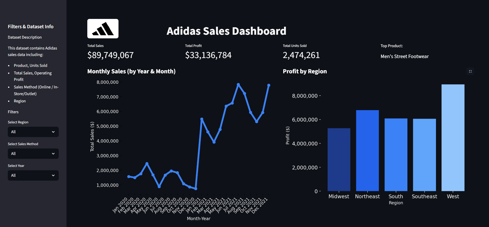
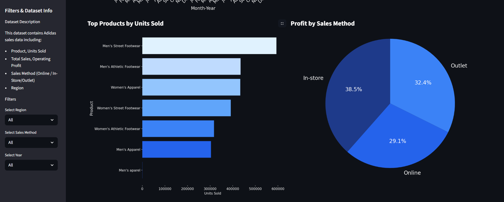
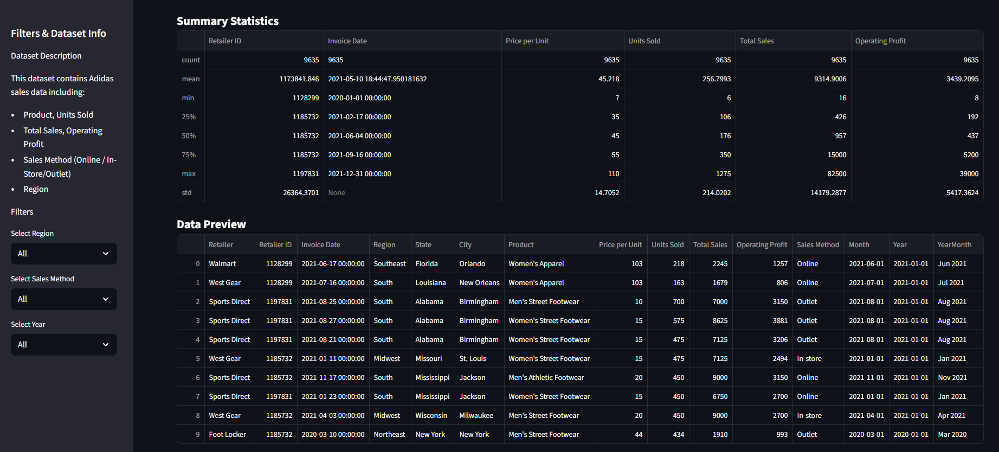

# Adidas Sales Dashboard – EDA & Interactive Visualization

This repository contains a complete Exploratory Data Analysis (EDA), data cleaning, and interactive dashboard project for Adidas sales data. Built with Python, Pandas, Matplotlib, Streamlit, and Plotly.

## Features

* Data Cleaning & Preprocessing

  * Remove missing or invalid values
  * Convert dates to datetime objects
  * Standardize numeric and currency columns

* Exploratory Data Analysis (EDA)

  * Summary statistics with .describe() 
  * Random samples and quick insights
  * Visualizations of sales trends, regional performance, and product performance

* Interactive Dashboard

  * Built with Streamlit for interactive exploration
  * Filters: Region, Sales Method, Year
  * KPIs: Total Sales, Total Profit, Total Units Sold, Top Product
  * Visualizations:

    * Monthly Sales Trend (line chart)
    * Profit by Region (bar chart)
    * Top Products by Units Sold (horizontal bar chart)
    * Profit by Sales Method (pie chart)
  * Custom dark theme and responsive layout

* Deployment

  * Streamlit app deployed with ngrok for secure public access

## Installation

pip install streamlit pandas matplotlib plotly pyngrok

## Run the Dashboard

streamlit run dashboard.py

## Dataset

* Original dataset: data_sales.csv (sourced from Kaggle)  
* Cleaned dataset used in the dashboard: cleaned_data_sales.csv

## Screenshots

